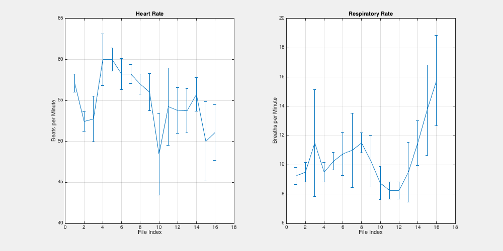

SCANPHYSLOG_Tools
=================
Software tools to load and analyze physiology monitoring log files from the Philips MRI scanner.

loadSCANPHYSLOG.m
=================
~~~~~
%
% [OUTPARAMS, WAVEFORMS] = LOADSCANPHYSLOG(SCANPHYSLOG_FILE_NAME)
%
% Loads data from the Philips MRI scanner SCANPHYSLOG file
% SCANPHYSLOG_FILE_NAME and returns the structures OUTPARAMS and WAVEFORMS
%
% outParams.scanphyslog_file_name % file name of loaded scanphyslog
% outParams.site_name             % site name
% outParams.SRN                   % scanner registration number
% outParams.release               % software release  
% outParams.SWID                  % software identifier
% outParams.date                  % date (yyyy-mm-dd)
% outParams.time                  % time (HH:MM:SS)
% outParams.dockable_table        % flag for dockable table
% outParams.nSamples              % number of samples
% outParams.sample_time_seconds   % sample time spacing
% outParams.time_duration_file_seconds % time duration of the file
% outParams.time_duration_scan_seconds % time duration of the scan
% outParams.scan_start_sample          % sample index of the scan start (mark==0x10)
% outParams.scan_stop_sample           % sample index of the scan stop  (mark==0x20)
%
% waveforms.v1raw        % VKG v1raw waveform
% waveforms.v2raw        % VKG v2raw waveform
% waveforms.v1           % VKG v1 waveform
% waveforms.v2           % VKG v2 waveform
% waveforms.ppu          % peripheral pulse unit (PPU) waveform
% waveforms.resp         % respiratory bellows waverform
% waveforms.gx           % x gradient waveform
% waveforms.gy           % y gradient waveform
% waveforms.gz           % z gradient waveform
% waveforms.mark_hex     % acquisition mark labels hexadecimal number
% waveforms.mark_dec     % acquisition mark labels as decimal number
% waveforms.time_seconds % time in seconds
%
% mark is stored in the file as a hexadecimal bitmask but returned as a
% decimal value. The meaning of the mark values are as follows:
%
% 0x01 = VKG trigger point
% 0x02 = ppu trigger point
% 0x04 = resp trigger point
% 0x08 = measurement marker
% 0x10 = start scan marker
% 0x20 = stop scan marker
%
% Since physiology data is collected from the start of the preparation
% phases, working backward from the stop scan marker by a known scan
% duration is one way to examine the physiology measurements occuring
% during the scan itself.
%
% Developed with MATLAB R2014b
%
% Supported by a grant from the National Institutes of Health (NIH), National
% Institute of Diabetes and Digestive and Kidney Diseases (NIDDK) - R01DK105371
%
~~~~~

process_SCANPHYSLOG_parent_folder.m
===================================
~~~~~
%
% OUTPARAMS = PROCESS_SCANPHYSLOG_PARENT_FOLDER(PARENT_FOLDER_NAME)
%
% Processes all SCANPHYSLOG files in the folder PARENT_FOLDER_NAME and
% returns the array of structures OUTPARAMS containing
%
% outParams(:).date               % date (yyyy-mm-dd)
% outParams(:).time               % time (HH:MM:SS)    
% outParams(:).N_heart_rate       % number of heart rate windows
% outParams(:).heart_rate_mean    % heart rate mean
% outParams(:).heart_rate_sigma   % heart rate standard deviation
% outParams(:).heart_rate_CI_HW % heart rate confidence interval half-width
% outParams(:).heart_rate_CI_LB % heart rate confidence interval lower bound
% outParams(:).heart_rate_CI_UB % heart rate confidence interval upper bound
% outParams(:).N_breath_rate       % number of breath rate windows
% outParams(:).breath_rate_mean    % breath rate mean
% outParams(:).breath_rate_sigma   % breath rate standard deviation
% outParams(:).breath_rate_CI_HW % breath rate confidence interval half-width
% outParams(:).breath_rate_CI_LB % breath rate confidence interval lower bound
% outParams(:).breath_rate_CI_UB % breath rate confidence interval upper bound
%
% OUTPARAMS = PROCESS_SCANPHYSLOG_PARENT_FOLDER(PARENT_FOLDER_NAME, PROCESSPARAMS)
%
% A comma separated variable file names 'SCANPHYSLOG.csv' is also written
% to disk.
%
% Uses the structure PROCESSPARAMS to control the processing of the
% SCANPHYSLOG files. Options and default values are:
%
% processParams.heart_rate_time_window_seconds           = 30;  % heart rate time window duration in seconds
% processParams.heart_rate_time_window_overlap_fraction  = 0.5; % heart rate window overlap fraction
% processParams.breath_rate_time_window_seconds          = 60;  % breath rate time window duration in seconds
% processParams.breath_rate_time_window_overlap_fraction = 0.5; % breath rate window overlap fraction
% processParams.confidence_level_interval_probability    = 0.95; % level for reported confidence intervals
% processParams.heart_rate_max  = 200;                           % maxmimum detectable heart rate (beats per minute)
% processParams.heart_rate_min  = 30;                            % minimum detectable heart rate (beats per minute)
% processParams.breath_rate_max = 30;                            % maxmimum detectable breath rate (breaths per minute)
% processParams.breath_rate_min = 8;                             % minimum detectable breath rate (breaths per minute)
% processParams.match_pattern       = '*SCANPHYSLOG*';           % pattern to detect SCANPHYSLOG files to process
% processParams.output_csv_filename = 'SCANPHYSLOG.csv';         % name for output CSV file
% processParams.output_folder = PARENT_FOLDER_NAME;              % name of parent folder containing SCANPHYSLOG files
% processParams.verbose = true;                                  % print progress messages
%
% Developed with MATLAB R2014b
%
% Supported by a grant from the National Institutes of Health (NIH), National
% Institute of Diabetes and Digestive and Kidney Diseases (NIDDK) - R01DK105371
%
~~~~~

example.m
=========
~~~~~
%% Run example SCANPHYSLOG processing
~~~~~

Figure 1. Plot of processed SCANPHYSLOG files
---------------------------------------------

example SCANPHYSLOG.csv contents
--------------------------------

| idx | date       | time     | N_heart_rate | heart_rate_mean | heart_rate_sigma | heart_rate_CI_HW | heart_rate_CI_LB | heart_rate_CI_UB | N_breath_rate | breath_rate_mean | breath_rate_sigma | breath_rate_CI_HW | breath_rate_CI_LB | breath_rate_CI_UB |
|-----|------------|----------|--------------|-----------------|------------------|------------------|------------------|------------------|---------------|------------------|-------------------|-------------------|-------------------|-------------------|
| 1   | 2016-02-01 | 09:50:15 | 9.00         | 57.11           | 1.76             | 1.09             | 56.02            | 58.20            | 4.00          | 9.25             | 0.50              | 0.59              | 8.66              | 9.84              |
| 2   | 2016-02-01 | 09:54:16 | 9.00         | 52.44           | 1.94             | 1.20             | 51.24            | 53.65            | 4.00          | 9.50             | 0.58              | 0.68              | 8.82              | 10.18             |
| 3   | 2016-02-01 | 09:58:53 | 8.00         | 52.75           | 4.13             | 2.77             | 49.98            | 55.52            | 4.00          | 11.50            | 3.11              | 3.66              | 7.84              | 15.16             |
| 4   | 2016-02-01 | 10:02:26 | 9.00         | 60.00           | 5.10             | 3.16             | 56.84            | 63.16            | 4.00          | 9.50             | 0.58              | 0.68              | 8.82              | 10.18             |
| 5   | 2016-02-01 | 10:06:07 | 8.00         | 60.00           | 2.14             | 1.43             | 58.57            | 61.43            | 4.00          | 10.25            | 0.50              | 0.59              | 9.66              | 10.84             |
| 6   | 2016-02-01 | 10:09:39 | 9.00         | 58.22           | 3.07             | 1.90             | 56.32            | 60.13            | 4.00          | 10.75            | 1.26              | 1.48              | 9.27              | 12.23             |
| 7   | 2016-02-01 | 10:13:21 | 9.00         | 58.22           | 1.86             | 1.15             | 57.07            | 59.37            | 4.00          | 11.00            | 2.16              | 2.54              | 8.46              | 13.54             |
| 8   | 2016-02-01 | 10:16:59 | 8.00         | 57.00           | 1.85             | 1.24             | 55.76            | 58.24            | 4.00          | 11.50            | 0.58              | 0.68              | 10.82             | 12.18             |
| 9   | 2016-02-01 | 10:21:58 | 8.00         | 56.00           | 3.38             | 2.26             | 53.74            | 58.26            | 4.00          | 10.25            | 1.50              | 1.77              | 8.48              | 12.02             |
| 10  | 2016-02-01 | 10:25:32 | 9.00         | 48.44           | 7.99             | 4.95             | 43.49            | 53.39            | 4.00          | 8.75             | 0.96              | 1.13              | 7.62              | 9.88              |
| 11  | 2016-02-01 | 10:29:08 | 8.00         | 54.25           | 7.05             | 4.72             | 49.53            | 58.97            | 4.00          | 8.25             | 0.50              | 0.59              | 7.66              | 8.84              |
| 12  | 2016-02-01 | 10:32:40 | 9.00         | 53.78           | 4.52             | 2.80             | 50.98            | 56.58            | 4.00          | 8.25             | 0.50              | 0.59              | 7.66              | 8.84              |
| 13  | 2016-02-01 | 10:36:15 | 8.00         | 53.75           | 4.06             | 2.72             | 51.03            | 56.47            | 4.00          | 9.50             | 1.73              | 2.04              | 7.46              | 11.54             |
| 14  | 2016-02-01 | 10:39:47 | 8.00         | 55.75           | 3.11             | 2.08             | 53.67            | 57.83            | 4.00          | 11.50            | 1.29              | 1.52              | 9.98              | 13.02             |
| 15  | 2016-02-01 | 10:43:19 | 9.00         | 50.00           | 7.81             | 4.84             | 45.16            | 54.84            | 4.00          | 13.75            | 2.63              | 3.09              | 10.66             | 16.84             |
| 16  | 2016-02-01 | 10:46:59 | 9.00         | 51.11           | 5.49             | 3.40             | 47.71            | 54.51            | 4.00          | 15.75            | 2.63              | 3.09              | 12.66             | 18.84             |

Grant Support
-------------
Supported by a grant from the National Institutes of Health (NIH), National Institute of Diabetes and Digestive and Kidney Diseases (NIDDK) - R01DK105371
